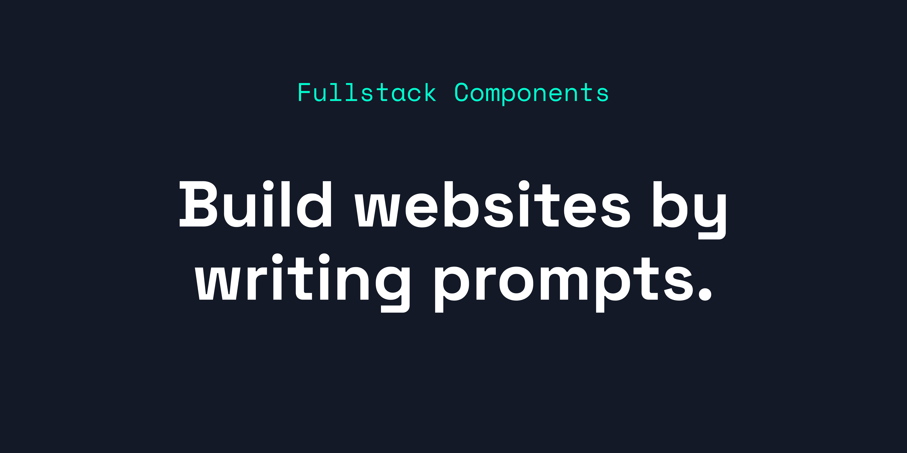

# [Fullstack Components](https://fullstack-components.vercel.app)

**Fullstack Components is an AI-powered library for Next.js that turns words into fully integrated components.**

Get started with AI on the web quickly and leverage AI as a natural part of development – all while retaining full control of your code.

## Quick Features

- **Get started with GPT prompts quickly:** Server Component and client react hooks for generic prompts
- **Generative UI:** Creates dynamic React components with a single prompt
- **Not Found Enhancement:** Uses AI to find the closest matching page to the `not found` URL and a helpful message for users
- **Image generation and vision API:** Image Server Component enhances `next/image` to auto add alt tags, or generate images with DALL·E
- **AI Text generation:** Create, modify and edit text with Server Components and dynamically with react hooks
- **AI Select Dropdown & Lists:** Generate, sort, select and label content in dropdowns or lists

## Getting Started

Visit [fullstack-components.vercel.app/docs/get-started](https://fullstack-components.vercel.app/docs/get-started) to get started with fullstack-components.

## Documentation

Visit [https://fullstack-components.vercel.app/docs](https://fullstack-components.vercel.app/docs) to view the full documentation.

## Feedback And Discussions

The Fullstack Components community can be found on [GitHub Discussions](https://github.com/trikinco/fullstack-components/discussions), where you can provide feedback, ask questions, voice ideas, and share your projects.

## Authors

- Lars Magnus Klavenes ([@larsmagnus](https://github.com/larsmagnus))
- Darragh O'Riordan ([@darraghoriordan](https://github.com/darraghoriordan))
- Connor Thomsen ([@cononic](https://github.com/CONONIC))

<a href="https://fullstack-components.vercel.app">
  <picture>
    <source media="(prefers-color-scheme: dark)" srcset="libs/playground/public/images/trikin-light.svg">
    
  </picture>
  
trikin

</a>
